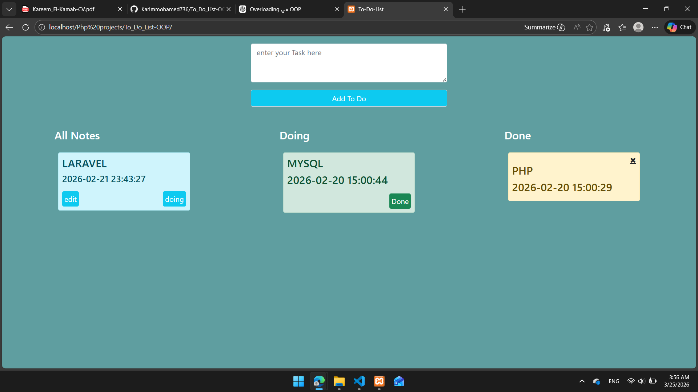
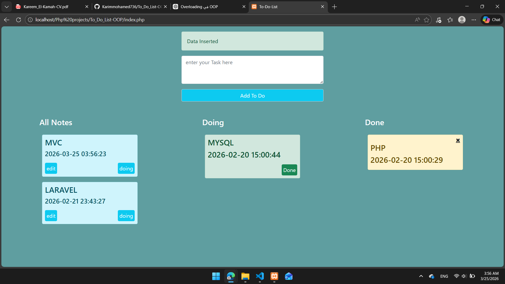
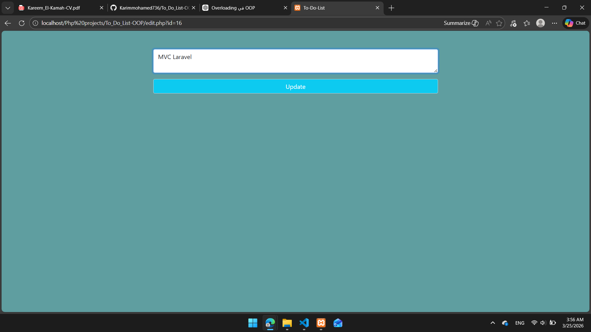
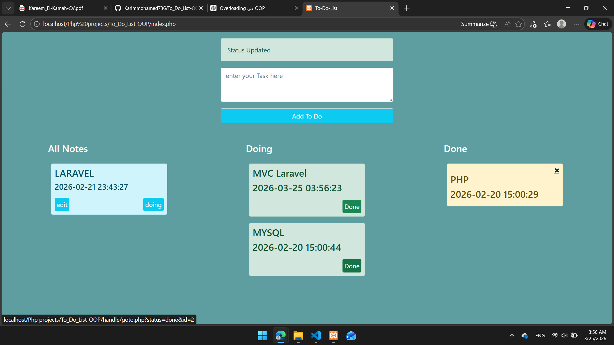

## 📝 Taskify – To Do List Management System
A simple and efficient To-Do List web application built using Core PHP & MySQL, designed to manage daily tasks with clean backend logic and secure database handling.

## 🚀 Features
- ➕ Add new tasks
- ✏️ Update existing tasks
- 🗑 Delete tasks
- 🔄 Change task status (Pending / Doing / Done)
- 💬 Flash Messages using Sessions
- ✅ Input Validation & Filtering
- 🛡 Protection against SQL Injection using PDO

## 🧠 Key Highlights
- Implemented full CRUD operations
- Used PDO prepared statements for secure database interaction
- Applied basic OOP concepts using custom classes
- Organized backend logic for better readability and maintainability
- Built a simple and user-friendly task workflow system

## 🛠️ Technologies Used
PHP (Core PHP)
- MySQL
- HTML / CSS / Bootstrap
- PDO

## ⚙️ Development Steps
- Established database connection using PDO
- Displayed all tasks in the main page (index.php)
- Implemented task creation using custom Request & Session classes
- Centralized application setup in App.php
- Added update functionality using prepared statements
- Implemented delete functionality via user interaction
- Enabled dynamic task status updates

## 📂 Project Structure
/classes   → Custom classes (Request, Session, etc.)
/handle    → CRUD operations logic
/inc       → Shared components (header, connection)
📸 Screenshots

📌 Add your screenshots here

🏠 All Tasks 

➕ Add Task

✏️ Update Task

🔄 Status Change

## ▶️ How to Run
Clone the repository:
git clone https://github.com/your-username/taskify.git
Move project to:
htdocs (XAMPP)
Import database via phpMyAdmin
Run:
http://localhost/To_Do_List-OOP/

## 🎯 Project Goal
To practice building a complete task management system using core PHP, focusing on:

CRUD operations
Secure database handling
Clean backend structure
Basic OOP concepts

## 👨‍💻 Author
Karim Mohamed 🚀